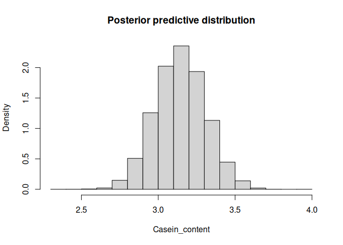

<!-- README.md is generated from README.Rmd. Please edit that file -->

# bplsr

<!-- badges: start -->
<!-- badges: end -->

The `bplsr` package implements the Bayesian partial least squares
regression model. It is a Bayesian factor model which emulates the
partial least squares (PLS) method. See Urbas et al. (2024) for details.

## Installation

Installing from CRAN:

``` r
install.packages('bplsr')
```

Installing directly from GitHub:

``` r
# install.packages("devtools")
devtools::install_github("SzymonUrbas/bplsr")
```

## Example

The following example illustrates how to carry out multivariate
regression using BPLS on mid-infrared spectral data of milk samples:

``` r
library(bplsr)


X = milk_MIR$xMIR
Y = milk_MIR$yTraits[, c('Casein_content','Fat_content')]

set.seed(1)
# fit model to 75% of data and predict on remaining 25%
idx = sample(seq(nrow(X)),floor(nrow(X)*0.75),replace = FALSE)

Xtrain = X[idx,];Ytrain = Y[idx,]
Xtest = X[-idx,];Ytest = Y[-idx,]

# fit the model (MCMC takes time)
bplsr_Fit = bplsr(Xtrain,Ytrain)

# generate predictions
bplsr_pred = bplsr.predict(model = bplsr_Fit, newdata = Xtest)

# point predictions
head(bplsr_pred$Ytest)
#>    Casein_content Fat_content
#> 5        3.142232    3.908393
#> 6        2.557213    4.109032
#> 7        2.739213    4.959536
#> 8        2.949198    5.058209
#> 9        2.773001    4.276898
#> 10       2.703331    4.500888

# lower and upper limits of prediction interval
head(bplsr_pred$Ytest_PI)
#> , , 2.5%
#> 
#>      Casein_content Fat_content
#> [1,]       2.824016    3.156057
#> [2,]       2.242527    3.343650
#> [3,]       2.421603    4.202634
#> [4,]       2.634399    4.301017
#> [5,]       2.449790    3.513700
#> [6,]       2.380676    3.732963
#> 
#> , , 97.5%
#> 
#>      Casein_content Fat_content
#> [1,]       3.468311    4.665851
#> [2,]       2.883415    4.877653
#> [3,]       3.064176    5.742868
#> [4,]       3.270263    5.837006
#> [5,]       3.093597    5.043436
#> [6,]       3.023982    5.269628

# plot of predictive posterior distribution for single test sample
hist(bplsr_pred$Ytest_dist[1,'Casein_content',], freq = F,
     main = 'Posterior predictive distribution', xlab = 'Casein_content')
```



### References

Urbas, S., Lovera, P., Daly, R., O’Riordan, A., Berry, D., and Gormley,
I. C. (2024). “Predicting milk traits from spectral data using Bayesian
probabilistic partial least squares regression.” *The Annals of Applied
Statistics*, 18(4): 3486-3506
[doi:10.1214/24-AOAS1947](https://doi.org/10.1214/24-AOAS1947)
